# Tower Defense Eternal

This is a classic Tower Defense game with procedurally generated level so you never run out.

You can download it [as an APK](https://github.com/dspeyer/tde/raw/refs/heads/main/godot-app/bin/TDEternal.apk)

## Basics

Enemies emerge from each 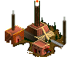 and try to destroy
your 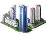.

Kill them first by building towers.  Towers will target enemies according to their policy (which you can set by tapping on the tower) unless a manually targetted enemy is within range, in which case they target that instead.  Towers cost money, which you get by killing enemies (you start with a little).

You can also upgrade towers, which improves damage, range, rate of fire and (for howitzers and flamethrowers) area-of-effect.

Enemies cannot go through towers, but you
must leave a path they can use (if you somehow manage to deny them a path, they will gain the ability to burrow through obstacles).

## Towers

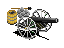 Artillery: Basic damage-dealer

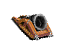 Cannon: Maximum DPS and range, but slow to fire

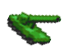 Howitzer: Fires rockets that explode on target

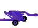 Laser: Overpenetrates to the edge of the world

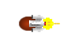 Flamethrower: Short range, damages all enemies it covers

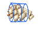 Pusher: Shoves targets back a short distance

## Enemies

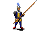: slow moving

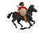: fast

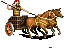: even faster, but slow to change direction

Any unit can also exist in extra-large form, with 3x the HP.

## Terrain

 Plains: the baseline against which all others are measured

 Swamp: cannot have towers, enemies move slowly

 Jungle: cannot have towers or enemies, but can be targetted and destroyed by cannons or artillery (leaving plains)

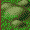 Hills: blocks enemies; towers have bonus range

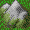 Mountains: blocks enemies and towers

## Victory Conditions

Withstand: Kill all enemies (there's a finite set)

Attack: Destroy enemy cities (now targettable) and units

Gather: Have sufficient money
